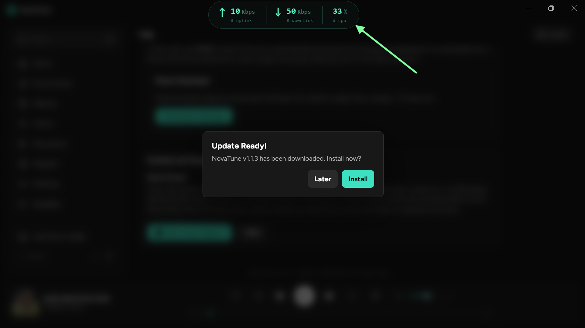

# NetWidget
> A frameless floating pill widget for Windows that shows real-time CPU load and network throughput — always on top, zero chrome, zero bloat.


---

## What it looks like


A dark pill-shaped overlay that lives at the top of your screen. Draggable. No taskbar entry. No window border.

---

## Features

- **Real-time stats at 1 s intervals** — upload speed, download speed, CPU usage
- **Active NIC auto-detection** — routes a dummy UDP socket to 8.8.8.8 and resolves the interface; refreshes every 10 ticks to handle Wi-Fi ↔ Ethernet switches without speed spikes
- **EMA smoothing** — `0.7 × raw + 0.3 × prev` on both upload and download to kill jitter
- **Unit toggle** — right-click the pill → `→ B/s` toggles between Mbps and MBps on the fly
- **Draggable on the X axis** — grab anywhere on the pill, release anywhere; position is persisted across restarts
- **Right-click context menu** — Exit / Toggle unit / Reset position / Cancel; auto-dismisses after 4 s
- **Always on top, frameless, transparent** — composited over your desktop with backdrop blur
- **Auto-installs `psutil`** if not present on first run
- **One-click NSIS installer** via `electron-builder`

---

## Stack

| Layer | Technology |
|---|---|
| Shell / window | Electron 29 |
| Stats backend | Python 3 + `psutil` |
| IPC | `child_process.spawn` → `stdout` JSON lines |
| UI | Vanilla HTML/CSS — Outfit font, CSS grid pill layout |
| Installer | electron-builder NSIS |

---

## Project structure

```
NETWORK-CPU-MONITOR-WIDGET/
├── main.js          # Electron main — window creation, IPC handlers, Python spawn
├── preload.js       # contextBridge — exposes api.stats(), api.quit(), api.setWindowPosition()
├── index.html       # Pill UI — layout, drag logic, unit toggle, confirm tooltip
├── stats.py         # Python stats daemon — psutil NDIS counters + PDH CPU → JSON stdout
├── start.bat        # Dev launcher: npm start
├── package.json     # electron-builder config, extraResources: stats.py
└── package-lock.json
```

---

## Requirements

- **Windows 10 / 11**
- **Node.js 18+** (for dev / building from source)
- **Python 3.8+** accessible as `python` or `python3` on PATH
  - `psutil` is auto-installed on first run if missing

---

## Quick start (dev)

```bat
git clone https://github.com/AnonymousV73X/NETWORK-CPU-MONITOR-WIDGET.git
cd NETWORK-CPU-MONITOR-WIDGET
npm install
npm start
```

Or double-click `start.bat`.

---

## Build installer

```bat
npm run build
```

Outputs an NSIS `.exe` installer under `dist/`. The installer is one-click, per-user, creates desktop + Start Menu shortcuts, and launches the widget after install. `stats.py` is bundled as an extra resource alongside the Electron app.

---

## How it works

```
Electron main.js
    │
    ├─ spawns stats.py as a child process
    │       │
    │       └─ emits one JSON line/sec:  {"dn": 12.4, "up": 0.3, "cpu": 37.1}
    │
    ├─ buffers stdout by newline, parses JSON, caches latest sample
    │
    └─ preload.js exposes window.api.stats()
            │
            └─ index.html polls every 1 s, formats values, updates DOM
```

`stats.py` resolves the active NIC by attempting a connectionless UDP connect to `8.8.8.8:80` and matching the returned local IP against `psutil.net_if_addrs()`. Byte deltas are divided by elapsed wall time and smoothed with an EMA before being converted to Mbps (`bytes / 125_000`).

---

## Interaction

| Action | Result |
|---|---|
| **Drag** (left-click + move) | Repositions pill horizontally |
| **Right-click** | Shows confirm tooltip |
| Tooltip → **Exit** | Kills Python subprocess, closes window |
| Tooltip → **→ B/s** | Toggles Mbps ↔ MBps display |
| Tooltip → **Reset** | Moves pill back to default position |
| Tooltip → **Cancel** / click outside | Dismisses tooltip |
| Tooltip auto-dismiss | 4 seconds of inactivity |

---

## Configuration

No config file. Everything is baked into `main.js` defaults:

| Setting | Default | Where to change |
|---|---|---|
| Window width | 300 px | `main.js` → `BrowserWindow` options |
| Window height | 59 px | `main.js` → `BrowserWindow` options |
| Y position (fixed) | 0 (top of screen) | `main.js` → `setPosition` |
| Poll interval | 1000 ms | `index.html` → `setInterval` |
| EMA alpha | 0.7 | `stats.py` → `ema_dn / ema_up` lines |
| NIC refresh rate | every 10 ticks | `stats.py` → `nic_check_counter` |

---

## Known constraints

- **Windows only.** The psutil NDIS counter path and the `Get-NetAdapterStatistics` fallback are both Windows-specific. macOS/Linux would need a different NIC resolution path.
- **Python must be on PATH** for the dev build. The packaged installer relies on a bundled Python runtime (not included by default — add a `python-standalone` extraResource if distributing to machines without Python).
- **Single monitor support.** The widget pins to the top of the primary display. Multi-monitor Y-axis positioning is not implemented.

---

## Author

**ANONYMOUS-V73X** — [github.com/AnonymousV73X](https://github.com/AnonymousV73X)
